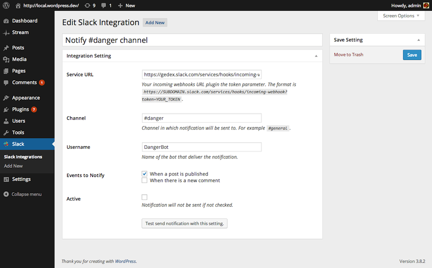

<!-- DO NOT EDIT THIS FILE; it is auto-generated from readme.txt -->
# Slack

Send notifications to Slack channels when certain events in WordPress occur.

**Contributors:** [akeda](http://profiles.wordpress.org/akeda), [reedyn](http://profiles.wordpress.org/reedyn)  
**Tags:** [slack](http://wordpress.org/plugins/tags/slack), [api](http://wordpress.org/plugins/tags/api), [chat](http://wordpress.org/plugins/tags/chat), [notification](http://wordpress.org/plugins/tags/notification)  
**Requires at least:** 3.6  
**Tested up to:** 3.9  
**Stable tag:** trunk (master)  
**License:** [GPLv2 or later](http://www.gnu.org/licenses/gpl-2.0.html)  
**Donate link:** http://goo.gl/DELyuR  

## Description ##

This plugin allows you to send notifications to [Slack](https://slack.com) channels when certain events in WordPress occur.

By default, there are two events that can be sent to Slack:

1. When a post needs review (status transitioned to 'pending')
1. When a post is published
1. When there's a new comment

It's possible to add more events using `slack_get_events` filter. For more information check [the doc](http://gedex.web.id/wp-slack/).

**Development of this plugin is done on [GitHub](https://github.com/gedex/wp-slack). Pull requests are always welcome**.

There are some extension plugins that notify events triggered by other plugins. Belows are some of them:

* [Slack EDD](http://wordpress.org/plugins/slack-edd)
* [Slack WooCommerce](http://wordpress.org/plugins/slack-woocommerce)
* [Slack Contact Form 7](http://wordpress.org/plugins/slack-contact-form-7)
* [Slack Gravity Forms](http://wordpress.org/plugins/slack-gravityforms)

## Installation ##

1. Upload **Slack** plugin to your blog's `wp-content/plugins/` directory and activate.
1. Add new **Incoming WebHooks** service in your Slack, the URL is `https://<SUBDOMAIN>.com/services/new/incoming-webhook` (replace `<SUBDOMAIN>` with your Slack's subdomain). Once created, note the URL of the service (you'll set it into integration entry in your WordPress).
1. Go to **Slack** menu in your WordPress to add the integration (make sure you're logged in as an Administrator).

## Screenshots ##

### Integrations list. Yes, you can add more than one integration.

### Edit integration screen.

### Your channel get notified when some events occur.

## Changelog ##

### 0.5.1 ###
* Removed bin directory for published plugin in WP.org. Props otto42

### 0.5.0 ###
* Added bot icon support

### 0.4.1 ###
* Fixed wrong text domain. Props [jphorn](https://github.com/jphorn)

### 0.4.0 ###
* Added `priority` key in event type array
* Make sure `wp_insert_comment` is invoked as late as possible by passing priority `999`
* Added comment text and linkable text to edit comment in notification message
* Added `post_pending_review` event type
* Added excerpt when a post needs review (status transitioned to 'pending')
* Added excerpt when a post is published
* Fixed typo

### 0.3.0 ###
* Add activate / deactivate link in row actions
* More columns in integration list table

### 0.2.0 ###
* For default "When a post is published" and "When there is a new comment" events, limit the post type to "post"
* Don't send notification if message evaluates to false
* Plugin's banner
* Put Slack URL in README

### 0.1.0 ###
Initial release

